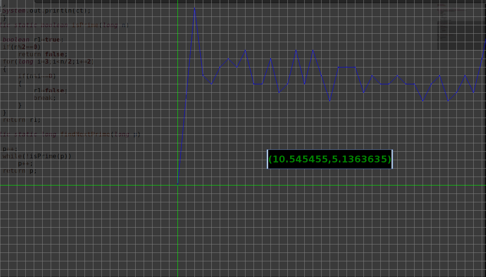

# AlgorithmPerformanceVisualization
Visualize how an algorithm performs (Command Line version of http://www.testmyalgo.com/ )

Run:
<pre>
#sudo bash install.sh
</pre>

Test a console application:
  

  <pre>
 $ FeedInput "java PrimeSum"
  </pre>
  
The performance of your program

  </img>
  
